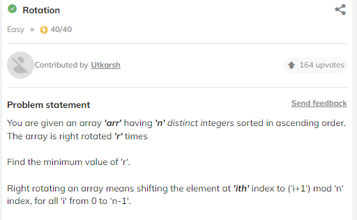

# BinaySearch
BinaySearch with Striver
---
- A Searching Algo
- Ex. Search page in book , search word in dict

> ## Iterative code 


```cpp
int search(vector<int> &nums, int key)
{
    int s = 0, e = nums.size() - 1, m;
    while (s <= e)
    {
        m = s + (e - s) / 2;
        if (nums[m] == key) return m;
        else if (nums[m] > key) e = m - 1;
        else  s = m + 1;
    }
    return -1;
}
```
> ## Recursion Code
```cpp
int bs(int s, int e, vector<int> &nums, int key)
{
    if (s > e)
        return -1;
    int m = s + (e - s) / 2;
    if (nums[m] == key)
        return m;
    else if (nums[m] > key)
        return bs(s, m - 1, nums, key);
    else
        return bs(m + 1, e, nums, key);
}
int search(vector<int> &nums, int key)
{
    int s = 0, e = nums.size();
    return bs(s, e, nums, key);
}
```
> ## Time Complexity
- Log(n) --> log2(n)
> ## OverFlow case
when s = num > 0, e = INT_MAX
than m = (s + e)/2  int over flow 
so use 
```cpp
m = s - (e-s)/2;
```
> # Lower Bound
Smallest Index such that arr[ind] >= x


Question


```cpp
int lowerBound(vector<int> arr, int n, int x) {
	int s =0,e = n-1 , m , lb = n ;
    while(s<=e){
        m = s + (e-s)/2;
         if(arr[m]>=x){
              e =m-1;
              lb = m;
        }
        else
            s = m+1;   
    }
    return lb;
}
```
> Recursion code
```cpp
int LB(int s , int e ,int &lb , int x, vector<int>& arr){
    if(s>e)return lb;
    int m = s + (e-s)/2;
    if(arr[m]>=x){
        lb = m;
     return LB(s, m-1,lb,x,arr);
    }
    else return LB(m+1,e,lb,x,arr);
}

int lowerBound(vector<int> arr, int n, int x) {
	int s =0,e =n-1,lb=n;
    return LB(s,e,lb,x,arr);
}
```
> ONE line code USing function
```cpp
int lowerBound(vector<int> arr, int n, int x) {
	
    return lower_bound(arr.begin(),arr.end(),x)-arr.begin();
}
```

> # UPPER BOUND
if smallest index such that arr[ind]>x


 


```cpp
int upperBound(vector<int> &arr, int x, int n){
	int s =0,e = n-1 ,m,ub=n;
	while(s<=e){
		m = s + (e-s)/2;
		if(arr[m]>x)
		{
			ub = m;
			e = m-1;
		}
		else s =m+1;
	}
	return ub;
}
```
> One line code 
```cpp
int upperBound(vector<int> &arr, int x, int n){
	
	return upper_bound(arr.begin(),arr.end(),x) - arr.begin();
}	
```
> # Search Insert Position


Approch --> this question can be solve by 
          both index due to unique element in the array

```cpp
// using lower bound
int searchInsert(vector<int>& arr, int m)
{
return lower_bound(arr.begin(),arr.end(),m)-arr.begin();

}
```
```cpp
// using uppor bound
int searchInsert(vector<int>& arr, int m)
{
return upper_bound(arr.begin(),arr.end(),m)-arr.begin();

}
```
># floor and cail


```cpp
pair<int, int> getFloorAndCeil(vector<int> &a, int n, int x) {
	// floor  largest element arr[i]<=x
    // ciel   smallest element arr[i]>=x // lower bound
    
    // floor  
    int fl =-1 , ci = -1;
    
    int s =0,e = n-1,m;
    while(s<=e){
        m = (s+e)/2;
        if (a[m] <= x) {
          s = m + 1;
          fl = a[m];
        } else
          e = m - 1;
    }
   
    // ceil (lower bound)
    s =0,e =n-1;
    while(s<=e){
        m = (s+e)/2;
        if (a[m] >= x) {
          e = m - 1;
          ci = a[m];
        } else
          s = m + 1;
    }


return {fl,ci};


}
```


> #  First and Last Position of an Element In Sorted Array


using upper bound and lower bound , if lb not exist than return {-1,-1}
```cpp
pair<int, int> firstAndLastPosition(vector<int>& arr, int n, int k)
{
 int s =0,e = n-1 , fist =n ,second = n,m;

 // lower bound
 while(s<=e){
     m = s + (e-s)/2;
     if(arr[m]>=k){
         fist = m;
         e = m-1;
     }
     else s = m+1;
 }

// upper bound
s =0;
e = n-1;
while(s<=e){
    m = s +(e-s)/2;
    if(arr[m]>k){
        second = m;
        e = m-1;
    }
    else {
        s = m+1;
    }
}
// if not presesent
if(fist==n||arr[fist]!=k)return{-1,-1};

return {fist ,second-1};

}
```
> # Number of occurrence

approch --> up - lb
```cpp
int count(vector<int>& arr, int n, int x) {
	// find lower bound
  int s =0,e = n-1,lb=n,ub=n,m;
  while(s<=e){
    m = s + (e-s)/2;
    if(arr[m]>=x){
      lb = m;
      e = m-1;
    }
    else s = m+1;
  }

  if(lb==n)return 0; // optional line

  // find uppor bound
  s =0,e = n-1;
  while(s<=e){
    m = s + (e-s)/2;
    if(arr[m]>x){
      ub = m;
      e = m-1;
    }
    else s = m+1;
  }
  return (ub - lb );

}
```

> #  Search In Rotated Sorted Array # IMPORTANT


Approch--> first take mid of array ,
now array divide is two part , and if all is unique element than it fixed than one part is sorted
and other part is unsorted than 
if first one is sorted and seach in between if element not present and search in other unsorted part

```cpp
int search(vector<int>& arr, int n, int k)
{
    int s =0,e = n-1,m;
    while(s<=e){
        m = s + (e-s)/2;
        if(arr[m]==k)return m;
        // fist part sorted
        if(arr[s]<=arr[m]){
            if(arr[s]<=k&&k<=arr[m])
            e = m-1;
            else
            s = m+1;
             
        }
        // second part is sorted
        else{
            if(arr[m]<=k&&k<=arr[e])
            s = m+1;
            else 
            e = m-1;
        }
    }
    return -1;
}
```
>#  Search In A Rotated Sorted Array II

> Approch --> this is same question like above 
some chance is that in between array may be present one digit more than one time 

- for solving this , we have to add a extra case trim condition

```cpp
bool searchInARotatedSortedArrayII(vector<int>&arr, int k) {
    int s =0,e=arr.size()-1,m;
    while(s<=e){
        m = s+(e-s)/2;
        if(arr[m]==k)return true;
        // trim case IMPORTANT
        if(arr[s]==arr[e]&&arr[s]!=k){
            s++;
            e--;
        }
        // first part sorted
        if(arr[s]<=arr[m]){
            if(arr[s]<=k&&k<=arr[m])
            e =m-1;
            else
            s = m+1;
        }
        // second part sorted
        else{
            if(arr[m]<=k&&k<=arr[e])
            s =m+1;
            else
            e = m-1;
        }
    }
    return false;
}
```
> #  Find Minimum in Rotated Sorted Array


>approch--> same as above we divide a arry in two part one is sorted and other is 
unsorted , than we take first as mini in between the sorted part and then my new searhing space will 
be unsorted part

```cpp
int findMin(vector<int>& arr)
{
    int s =0,e =arr.size()-1,m,mini=INT_MAX;
    while(s<=e){
        m = s + (e-s)/2;
        // first part sorted
        if(arr[s]<=arr[m]){
            mini = min(mini ,arr[s]);
            s = m+1;
        }
        // second part sorted
         else{
             mini = min(mini ,arr[m]);
             e = m-1;
         }
    }
    return mini;
	
}
```
># Rotation IMPORTANT



> Approch --> int this question for find the no of rotaion we have to find the index of the mini 
element  in the array , it will be the no of roation

```cpp
int findKRotation(vector<int> &arr){
    //index of min
     int s =0,e=arr.size()-1,m,ind , mini = 1e8;
     while(s<=e){
         m = s+(e-s)/2;
         // first is sorted
         if(arr[s]<=arr[m]){
           if (mini > arr[s]) {
             ind = s;
             mini = arr[s];
           }
                 s = m+1;
         }
         // second part sorted
         else {
                 if (mini > arr[m]) {
             ind = m;
             mini = arr[m];
                 }
                 e =m-1;
             
         }
     }
     return ind;    
}
```
> #  Single Element in a Sorted Array


APProch--> see the position of middle 
```cpp
int singleNonDuplicate(vector<int>& arr)
{
    int n = arr.size();
	// base case and edge case
	if(n==1)return arr[0];
	if(arr[0]!=arr[1])return arr[0];
	if(arr[n-2]!=arr[n-1])return arr[n-1];

	int s =1,e =n-2,m;
	while(s<=e){
		m = (s+e)/2;

		if(arr[m]!=arr[m-1]&&arr[m]!=arr[m+1])return arr[m];
		// mid is at odd position
		if(m&1){
           if(arr[m]==arr[m-1])s =m+1;
			else e = m-1;
		}
		// mid is ad even position
		else{
            if(arr[m]==arr[m+1])s =m+1;
		   else e = m-1;
		}
	}
}
```
> #  Square Root of a number


Approch --> ans can be [1,n]
apply binary search b/w [1,n]
```cpp
int floorSqrt(int n)
{
   int s =0,e=n;
   long long m;
   while(s<=e){
       m = (s+e)/2;
       if(m*1LL*m>n)e =m-1;
       else s = m+1;
   }
   return e;
}
```
> #  Find Nth Root Of M # IMPORTANT


Approch --> like root of a number 
but in this case the multipy function is important consept because 
in b/w exponent of mid^n not possible using binary exopent
so use unique approch

```cpp
int fun(int mid ,int n,int m){
    long long a = 1;
    for(int i =0;i<n;i++){
        a *=mid;
        if(a>m)return 2;
    }
    if(a<m)return -1;
     return 1;
}

int NthRoot(int n, int m) {
        int s =1,e=m,mid;
        while(s<=e){
            mid = (s+e)/2;
            int val = fun(mid,n,m);
            if(val==1)return mid;
            else if (val==-1) s =mid+1;
            else e = mid-1;
        }
        return -1;

}
```
> # Koko Eating Bananas
Approch--> ans range will be [1,INT_MAX] 
we take mid ad each time try to minimize the ans 
if it fit koko are possible to eat bananas

```cpp
int minEatingSpeed(vector<int>& arr, int h) {
        int s = 1, e = INT_MAX, m;
        while (s <= e) {
            m = s + (e - s) / 2;
            // .......................
            // if koko eat m bana in one hour 
            // than total hour ot eat all bananas
            long long Hour = 0;
            for (auto x : arr)
                Hour += (x + m - 1) / m;
            // ..................

            if (Hour <= h)
                e = m - 1;
            else
                s = m + 1;
        }
        return s;
    }
```

